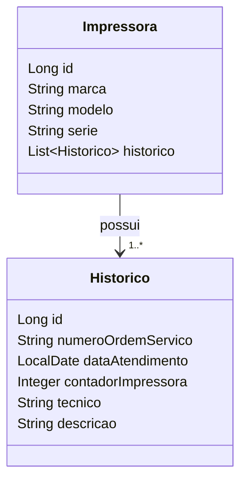

# Impressoras-historico

## Diagrama de Classes

```mermaid
classDiagram
    class Impressora {
        Long id
        String marca
        String modelo
        String serie
        List~Historico~ historico
    }

    class Historico {
        Long id
        String numeroOrdemServico
        LocalDate dataAtendimento
        Integer contadorImpressora
        String tecnico
        String descricao
    }

    Impressora --> "1..*" Historico : possui
```